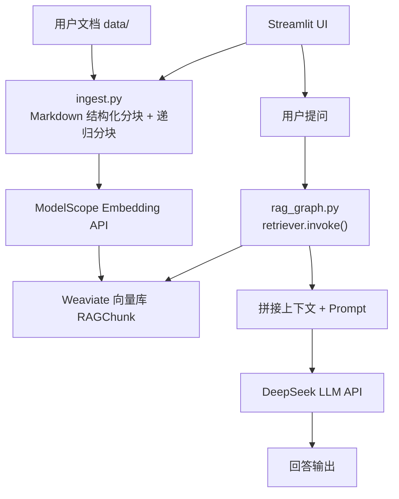

# LangGraph RAG 知识库问答机器人（中文详细说明）

这个项目是一个最小可用的 RAG（Retrieval-Augmented Generation，检索增强生成）问答机器人示例（**全程 API，不在本地运行任何模型**）：
- **知识入库**：把 `data/` 目录里的文档切分成 chunk，生成向量并写入 **Weaviate** 向量数据库。
- **问答**：用户提问 → 从向量库检索相关片段 → 把“检索到的上下文”塞进提示词 → 让大模型基于上下文回答（不编造）。

适合你先跑通一条“从文档到可问答”的最短链路，然后再按需扩展（支持 PDF/Word、Web UI、多轮对话、权限、多知识库等）。

新手上手指南：`docs/PROJECT_GUIDE.zh-CN.md`

---

## 流程图（Mermaid）



---

## 目录结构

- `data/`：你的知识库源文件（当前示例支持 `.md/.txt/.mdx`）
- `storage/chroma/`：已不再使用（当前版本改为 Weaviate 服务）
- `src/rag/ingest.py`：入库脚本（加载 → 切分 → 嵌入 → 写入向量库）
- `src/rag/rag_graph.py`：问答脚本（LangGraph：retrieve → generate）

---

## 环境要求

- Python 3.10+
- LLM（大模型）默认使用 **DeepSeek**（OpenAI 兼容接口），需要 `DEEPSEEK_API_KEY`
- Embeddings（向量嵌入，用于检索）**只走 API**：
  1) **ModelScope Embeddings（OpenAI 兼容接口）**：需要 `MODELSCOPE_API_TOKEN`、`MODELSCOPE_BASE_URL`、`MODELSCOPE_EMBED_MODEL`
  2) **OpenAI Embeddings**：需要 `OPENAI_API_KEY`

---

## 安装依赖

```bash
python -m venv .venv
source .venv/bin/activate
pip install -r requirements.txt
```

---

## 配置（推荐使用 .env）

1) 复制一份示例环境变量文件：
```bash
cp .env.example .env
```

2) 编辑 `.env`，至少填好：
- `LLM_PROVIDER=deepseek`
- `DEEPSEEK_API_KEY=...`

你也可以按需修改（仅 API 方式）：
- `DEEPSEEK_MODEL`：默认 `deepseek-chat`
- `DEEPSEEK_TEMPERATURE`：默认 `0.2`
- `EMBED_PROVIDER`：默认 `modelscope`
- `MODELSCOPE_API_TOKEN`、`MODELSCOPE_BASE_URL`、`MODELSCOPE_EMBED_MODEL`（例如 `Qwen/Qwen3-Embedding-8B`）
此外还需配置 Weaviate：
- `WEAVIATE_URL`（例如 `http://localhost:8080`）
- `WEAVIATE_API_KEY`（如有）

---

## 1) 准备知识库文件

把你的文档放进 `data/` 目录（支持子目录）。当前版本会读取：
- `.txt`
- `.md`
- `.mdx`

示例文件：`data/sample.md`

提示：
- 文档尽量用 UTF-8 编码
- 结构清晰（标题、列表）有助于分块后检索

---

## 2) 入库（构建向量库）

运行：
```bash
python src/rag/ingest.py
```

它会做这些事：
1) 读取 `data/` 下所有文本文件
2) **对 Markdown 先按标题结构分块**（H1/H2/H3），再用 `RecursiveCharacterTextSplitter` 切成 chunk（默认 `chunk_size=800`、`chunk_overlap=120`）
3) 对每个 chunk 生成向量 embedding
4) 写入 Weaviate（默认类名 `RAGChunk`）

如果 `data/` 里没有文件，会直接报错提示你添加文档。

---

## 3) 启动问答机器人（CLI）

运行：
```bash
python src/rag/rag_graph.py
```

交互示例：
- 你输入：`你们的退款规则是什么？`
- 机器人流程：
  1) **retrieve**：从 Chroma 向量库里检索最相关的 4 个 chunk（MMR 策略，减少重复）
  2) **generate**：把检索到的内容拼进 Prompt 的 `{context}`，让 LLM 只基于上下文回答

如果知识库上下文里没有答案，机器人会明确说“不知道/无法从上下文得到答案”，避免硬编。

---

## 4) 启动 Web 界面（Streamlit，支持文档管理）

运行：
```bash
streamlit run app.py
```
如果提示 `streamlit: command not found`，请先激活虚拟环境（`source .venv/bin/activate`），或直接运行：
```bash
.venv/bin/streamlit run app.py
```

你将获得一个网页界面：
- 左侧栏：上传/删除 `data/` 里的文档，并一键“重新入库（重建向量库）”
- 主界面：聊天问答，默认会尝试流式输出（边生成边显示）

---

## 5) 使用 Agent Chat UI（LangGraph 兼容接口）

本项目额外提供了一个“最小可用”的 LangGraph 兼容 HTTP API（用于 Agent Chat UI），默认监听 `http://localhost:2024`。

1) 启动 API：
```bash
./scripts/run_langgraph_api.sh
```

2) 用账号密码换取 `api_key`（作为 `x-api-key`）：
```bash
curl -sS -X POST http://localhost:2024/auth/login \
  -H 'Content-Type: application/json' \
  -d '{"username":"YOUR_USER","password":"YOUR_PASS"}'
```
把返回的 `api_key` 复制出来。

3) 运行 Agent Chat UI（一个独立的 Next.js 项目），并在界面里填：
- `Deployment URL`：`http://localhost:2024`
- `Assistant / Graph ID`：`agent`
- `LangSmith API Key`：粘贴上一步拿到的 `api_key`

## Weaviate 安装（Docker Compose）

在项目根目录运行：
```bash
docker compose up -d
```

健康检查：
```bash
curl http://localhost:8080/v1/.well-known/ready
```
返回 `true` 即可。

---

## Embedding 模型一致性

一旦你用“某个 embedding 模型”入库，问答时也要用同一个 embedding 模型来检索，否则向量空间不一致，效果会很差。

---

## 常见问题（Troubleshooting）

1) **`Vector store not found ... Run ingest first`**
- 你还没运行 `python src/rag/ingest.py`，或者 `storage/chroma/` 被删了。

2) **OpenAI 鉴权失败 / 401**
- 如果你用的是 DeepSeek：检查 `.env` 里 `DEEPSEEK_API_KEY` 是否正确
- 如果你切到了 OpenAI：检查 `.env` 里 `OPENAI_API_KEY` 是否正确
- 确保启动脚本前环境变量生效（项目里已自动读取 `.env`）

3) **回答不准 / “找不到答案”太多**
- 确认你文档内容确实包含答案
- 适当调小 chunk（如 `chunk_size=500`）或调大 `k`
- 文档如果是扫描 PDF/图片，需先 OCR 成文本再入库

4) **想支持 PDF/Word/网页**
- 当前 `ingest.py` 只读取纯文本/Markdown。
- 下一步通常是引入 LangChain 的 loader（例如 PDF loader），把它们转成 `Document` 后复用现有切分与入库逻辑。

---

## 想要 Web 版（FastAPI/Streamlit）？

现在这个版本是最简单的 CLI。如果你希望：
- Web UI
- 多轮对话上下文记忆
- 用户隔离（每人一个向量库/命名空间）
- 同时支持多个知识库

告诉我你的偏好（FastAPI / Streamlit / Next.js），以及你用的模型提供商（OpenAI / Azure / 其他），我可以直接在这个项目里给你搭好。
